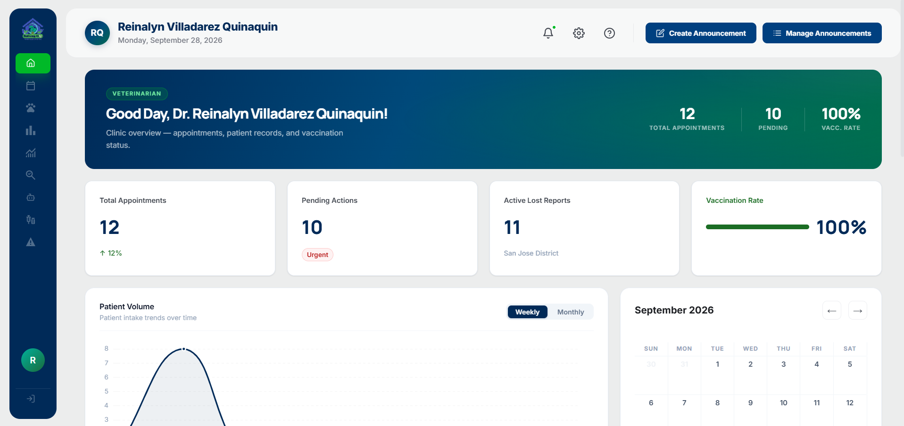
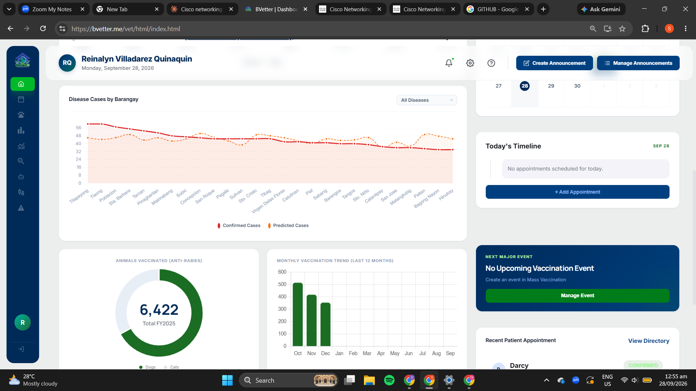
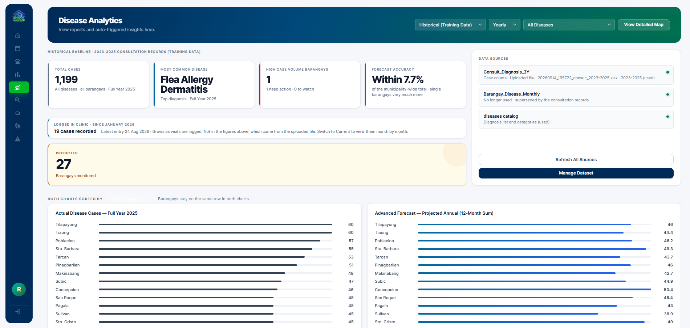
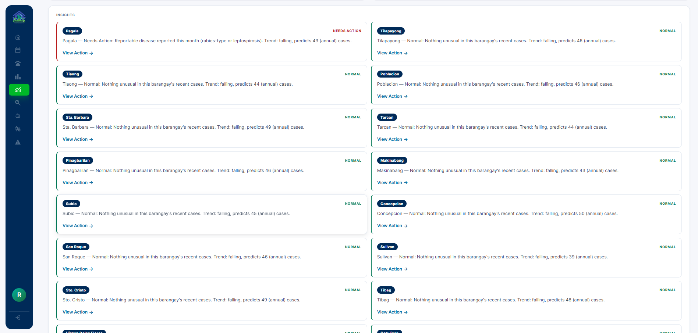
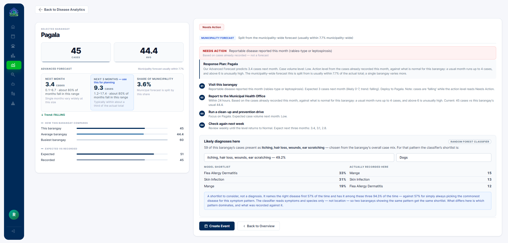
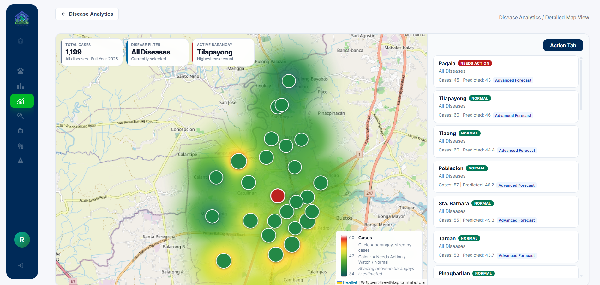
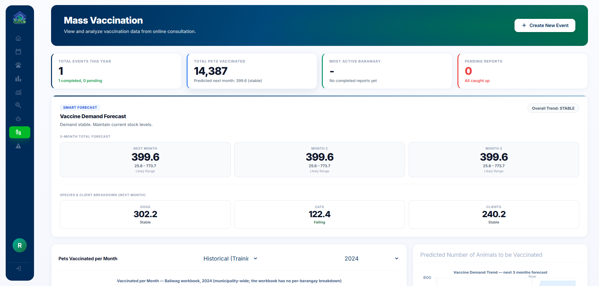
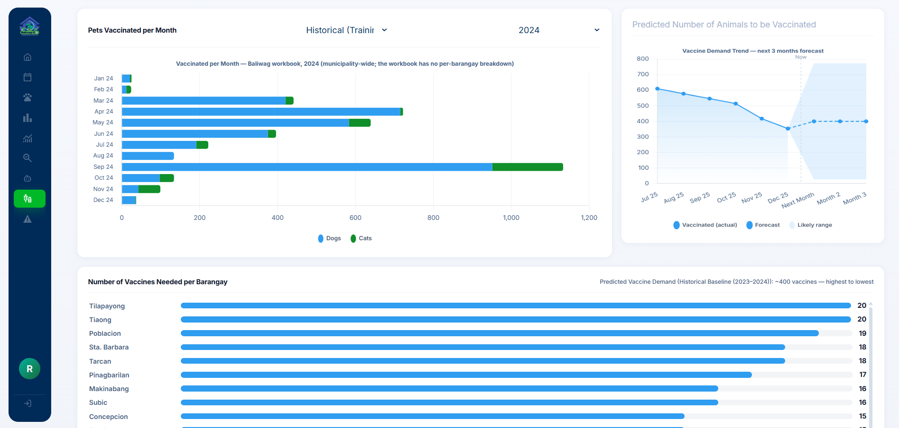
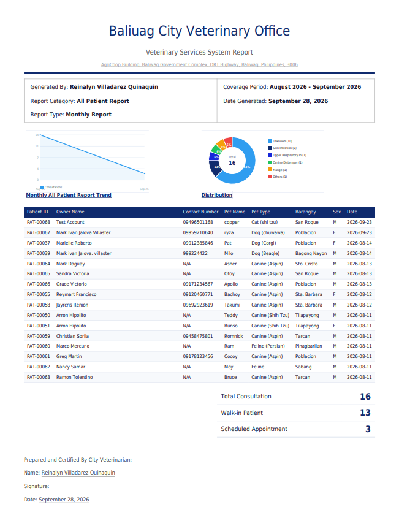

# 🐾 BVetter — Data-Driven Veterinary Services System

**A web-based veterinary management platform with predictive analytics, built for the Baliuag Veterinary Services Office (Baliuag City, Bulacan) to replace manual logbooks with centralized data, disease forecasting, and vaccination planning.**

🔗 **Live site:** [bvetter.me](https://bvetter.me) — public portal is open to browse
📊 Capstone Project — BS Information Technology, Bulacan State University (Bustos Campus)

---

## 📌 The Problem

The Baliuag Veterinary Services Office relied on paper logbooks and scattered spreadsheets to track consultations and vaccinations. This made it hard to spot disease trends early, plan vaccination drives, or respond quickly to outbreaks — and pet owners had no easy way to get information or find lost pets.

## 💡 What We Built

BVetter centralizes veterinary records and layers predictive analytics on top of them, so the office can move from reactive record-keeping to proactive action. It has three portals — **Pet Owner**, **Veterinarian**, and **Admin** — plus machine learning running in the background at two levels: municipality-wide forecasting, and per-barangay, per-case decision support.

| Model | Purpose |
|---|---|
| **Random Forest (case-level)** | Given a set of symptoms, predicts the most likely disease diagnosis before lab confirmation |
| **Random Forest (barangay-level)** | Predicts disease frequency and risk level per barangay from historical case data |
| **ARIMA (time-series)** | Forecasts vaccine demand per barangay for upcoming mass vaccination drives |

---

## 📊 Key Insights the System Surfaces

Pulled directly from the live dashboards:

- **1,199 disease cases** tracked across all barangays for Full Year 2025, with **Flea Allergy Dermatitis** as the top diagnosis
- Only **1 barangay** currently flagged "Needs Action" out of 27 monitored — down from 7 flagged earlier in the year, showing the risk model tightening as more data comes in
- Disease forecast performs **within 7.7%** of actual municipality-wide totals
- **6,422 animals** vaccinated against rabies in FY2025 (dogs and cats tracked separately), with a live monthly trend chart
- Vaccine demand forecasting breaks down by barangay, species, and expected client turnout for the next 3 months
- Since going live in January 2026, the clinic has logged real-time cases directly in-app — 19 recorded so far, separate from the historical training baseline

## 🧠 Beyond Dashboards: AI-Assisted Decision Support

This is the part that sets BVetter apart from a typical reporting dashboard — it doesn't just show numbers, it tells staff what to do with them.

**Per-barangay action plans.** Clicking into a flagged barangay (e.g. Pagala, flagged for a reportable rabies-type/leptospirosis case) generates a concrete 4-step response plan: visit the barangay, report to the Municipal Health Office within 24 hours, run a clean-up/prevention drive, and re-check in a week — each step reasoned against that barangay's own historical case volume, not a generic threshold.

**Symptom-based diagnosis classifier.** Given a symptom pattern (e.g. itching, hair loss, wounds, ear scratching), the Random Forest model returns a ranked shortlist of likely diagnoses with confidence scores — e.g. Flea Allergy Dermatitis 33%, Skin Infection 31%, Mange 19%. Evaluated against actual clinic records, the model names the correct disease first 57% of the time and has it within its top-3 shortlist 94.3% of the time, compared to a 57% baseline from just guessing the most common disease every time.

**Automated LGU-ready reporting.** The system generates an official, letterhead-formatted PDF report — consultation trend chart, diagnosis distribution, full patient table, and a signature block for the City Veterinarian — ready to submit without manual reformatting in Word or Excel.

---

## 🖥️ Screenshots

### Veterinarian Dashboard
Live clinic overview: appointments, pending actions, active lost-pet reports, and vaccination rate at a glance.

Scrolling further: disease case trends by barangay and FY2025 vaccination totals.

### Disease Analytics
Municipality-wide case totals, top diagnosis, forecast accuracy, and data source tracking.

Auto-generated, plain-language insights per barangay — flags which ones need action and why.

Drilling into a flagged barangay: forecast breakdown, comparison to municipality averages, the generated response plan, and the symptom-based diagnosis classifier.

### Disease Risk Map
Barangays plotted on an interactive map, color-coded by risk level and sized by case count.

### Mass Vaccination Forecasting
ARIMA-based 3-month vaccine demand forecast, broken down by species and expected client turnout.

Monthly vaccination history and predicted vaccine need per barangay.

### Automated Report Export
Official, government-letterhead PDF report generated directly from live data — no manual formatting needed.

---

## 🛠️ Tech Stack

| Layer | Technology |
|---|---|
| Frontend | HTML, CSS, Vanilla JavaScript |
| Backend | PHP 8.x |
| Database | MySQL |
| Analytics | Python — Random Forest (scikit-learn), ARIMA/SARIMA (statsmodels) |
| Image Matching | Python — Pillow (perceptual hashing + color histogram) |

---

## 🎯 Study Objectives

This system was built to answer:
1. How can fragmented, paper-based veterinary records be structured into a centralized system?
2. How can machine learning transform historical data into actionable disease and vaccination forecasts?
3. How can predictive models be evaluated for accuracy and reliability (precision, recall, F1-score)?
4. How can a chatbot and similarity-matching module improve service accessibility?

Evaluated against **ISO/IEC 25010** software quality standards and the **Technology Acceptance Model (TAM)**.

---

## 📎 Related Links

- 🔗 Live site: [bvetter.me](https://bvetter.me)
