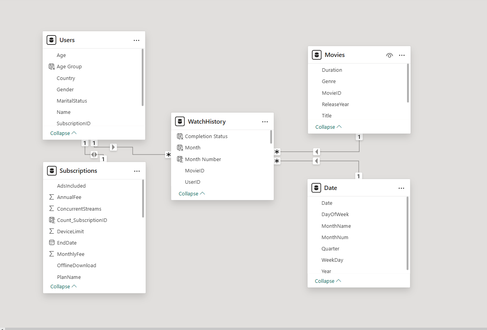
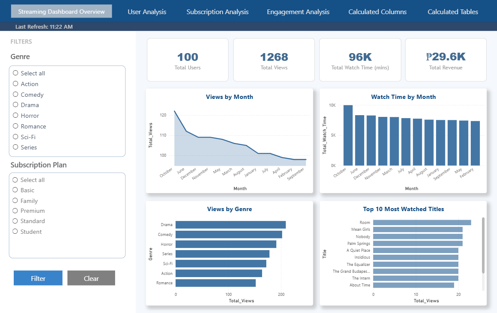
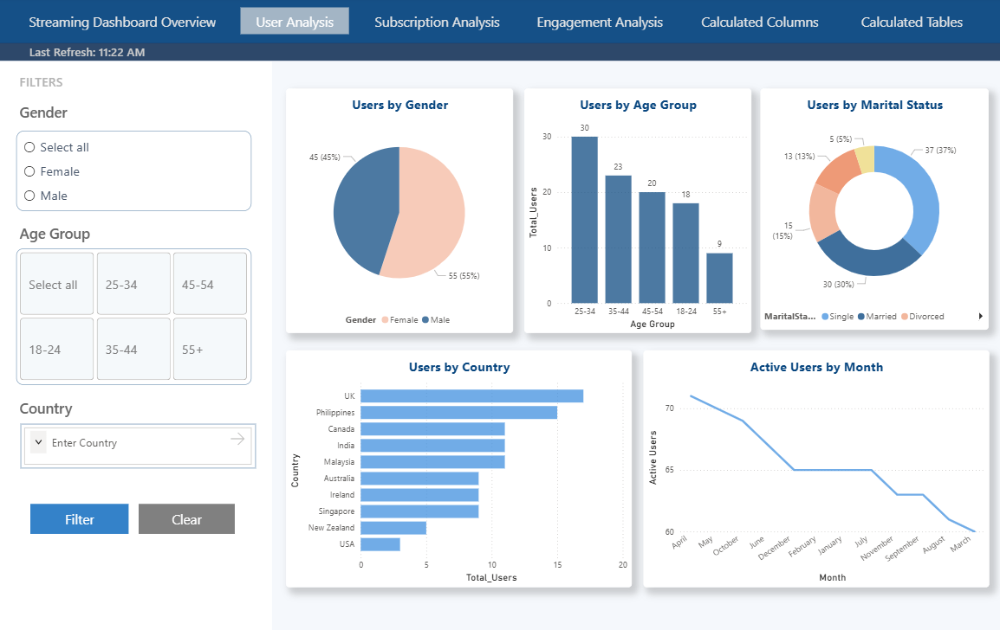
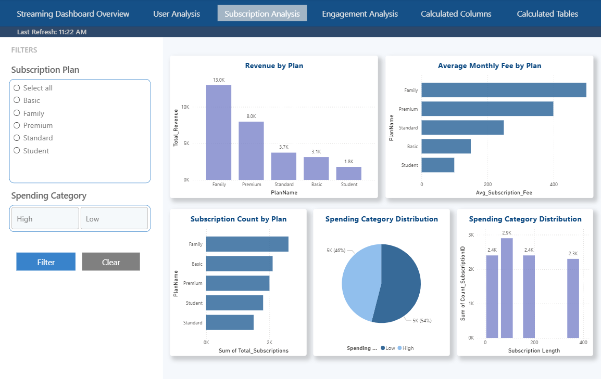
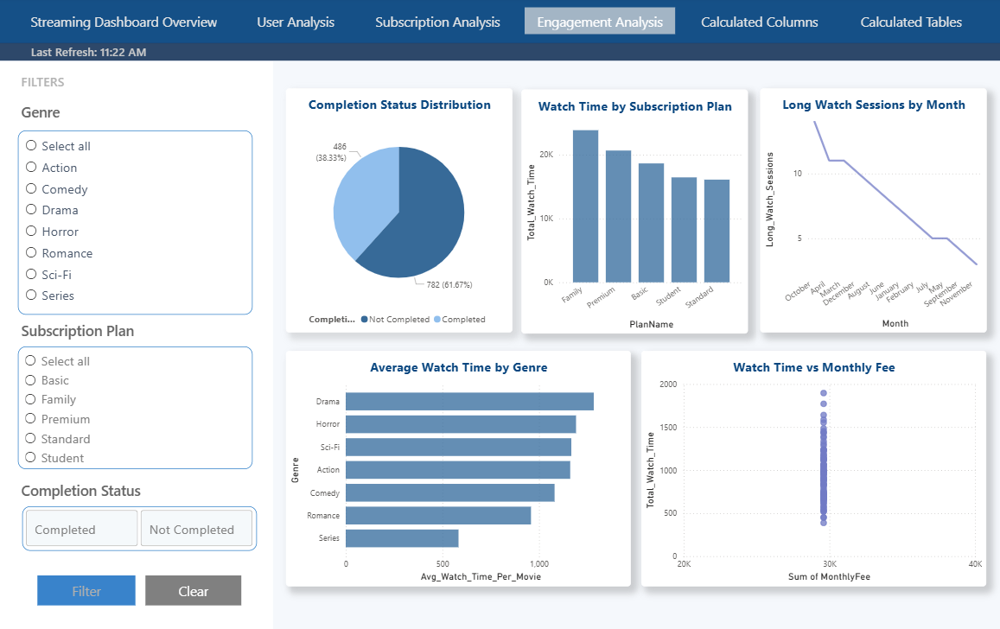
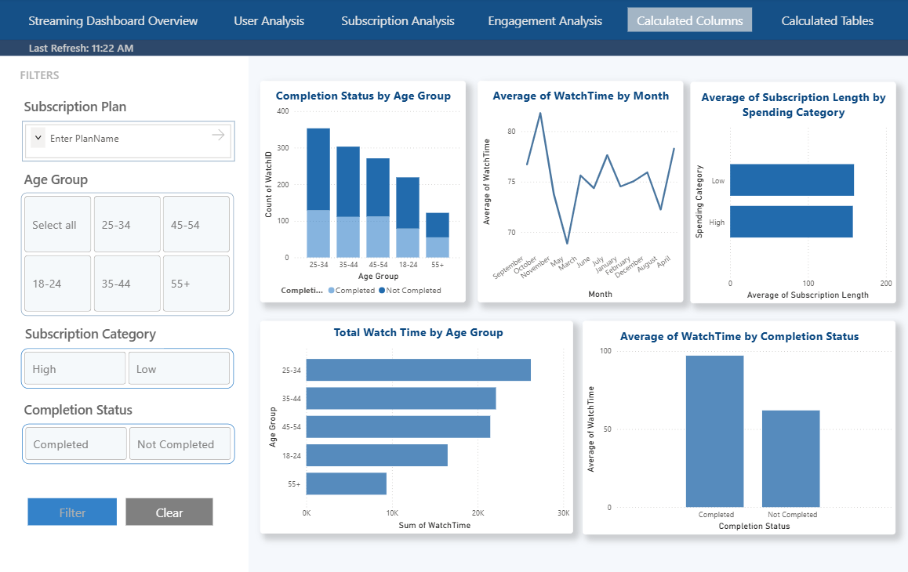
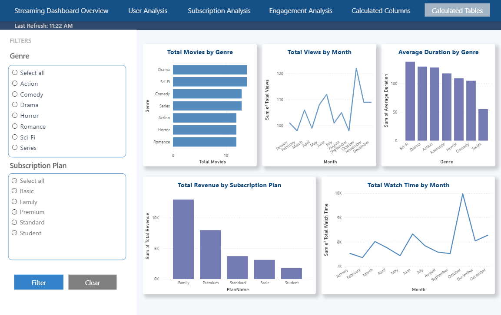

# 🎬 Movie Streaming Analytics Dashboard

**A Power BI dashboard analyzing users, subscriptions, and viewing behavior for a fictitious movie streaming platform — built to demonstrate data modeling, DAX, and business intelligence storytelling.**

📚 Academic Project — IT 307D (Database Administration/Analytics), BS Information Technology, Bulacan State University
👥 Group project — my role: **Visualization & Documentation**

---

## 📌 Overview

This project simulates a real-world streaming platform (users, subscription plans, movie catalog, and watch history) to practice turning raw relational data into a working analytics product. The dataset spans 5 related tables and over 300 watch records, modeled and analyzed entirely in Power BI.

## 🧩 Data Model

5 tables connected through a star-schema-style model: **Users**, **Movies**, **Subscriptions**, **WatchHistory** (fact table), and **Date**.

- `WatchHistory` links to both `Users` and `Movies`, making it the central fact table for engagement analysis
- `Users` links to `Subscriptions` to connect demographics with billing/plan data
- `Date` supports time-based filtering and trend analysis across all visuals

## 📊 Dashboards & Key Insights

### 1. Streaming Dashboard Overview

- 100 registered users generated **1,268 total views** and **96,000 minutes** of total watch time — roughly 12–13 titles watched per user
- Views peaked in October and declined steadily every month after — but watch time per month stayed relatively flat, meaning fewer users were watching, but the ones who did stayed engaged
- **Drama** and **Comedy** are the most-watched genres; Romance the least
- Total revenue: ₱29.6K, averaging ~₱300 per user

### 2. User Analysis

- Near-even gender split (55% male / 45% female)
- The **25–34 age group** is the largest user segment; 55+ is the smallest
- Single users make up the largest marital-status group (37%)
- Active users declined from ~71 (April) to ~60 (March) — a gradual drop-off worth flagging for retention

### 3. Subscription Analysis

- The **Family plan** drives the most revenue (₱13K) *and* has the most subscribers — it's both the most popular and most profitable tier
- 54% of users are classified as high spenders, and high spenders also have longer subscription durations — spending correlates with retention

### 4. Engagement Analysis

- Only **38% of watch sessions were completed** — most users stop before finishing a title
- Family-plan users log the most total watch time (consistent with them being the largest subscriber base)
- Paying more doesn't correlate with watching more — watch time varies widely even among users at similar fee levels

## 🛠️ What We Built (DAX & Calculated Columns)

24 DAX measures and 6 calculated columns were created to support the dashboards, including:

- **Active User Rate** — `DIVIDE([Active Users], [Total Users], 0)`, distinguishing users who actually watch content from those who just registered
- **Completion Rate** — measures how much of a title users watch before stopping, a proxy for content quality/fit
- **Revenue per Plan / Revenue per User** — ties engagement data to monetization
- **Age Group** (calculated column) — buckets raw age into brackets for cleaner demographic segmentation
- **Completion Status** (calculated column) — flags each watch session as Completed / Not Completed based on watch time vs. movie duration

Full breakdown of all 24 measures and their reasoning is in the project documentation.

## 🛠️ Tech Stack

Power BI · DAX · Power Query · Data Modeling

## 📎 Files

- Full documentation with table-by-table breakdown, all 24 DAX justifications, and calculated table logic available on request
